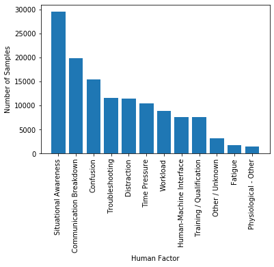
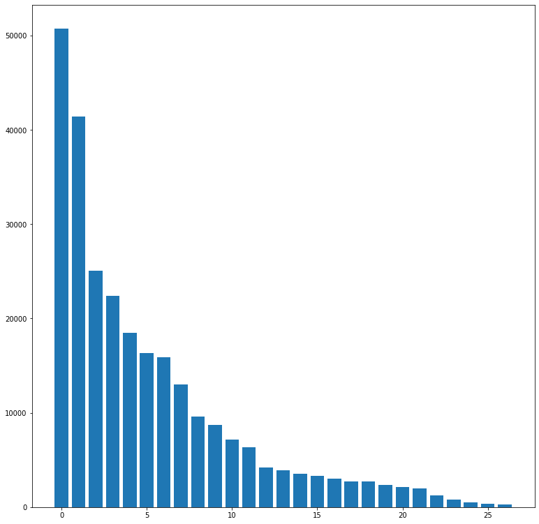
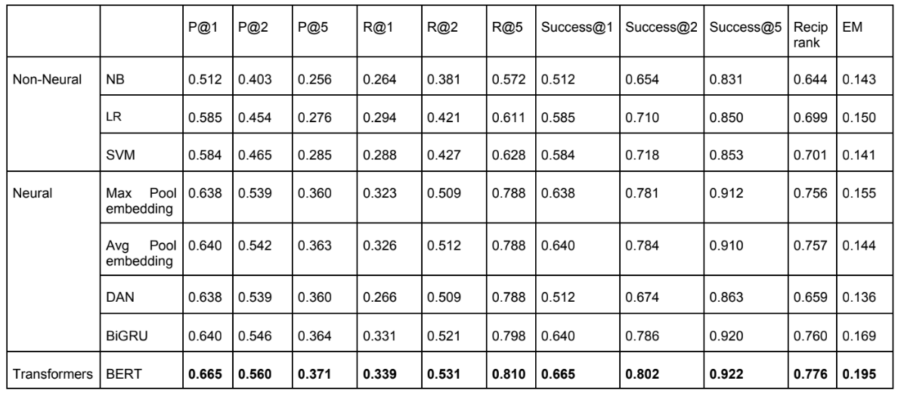
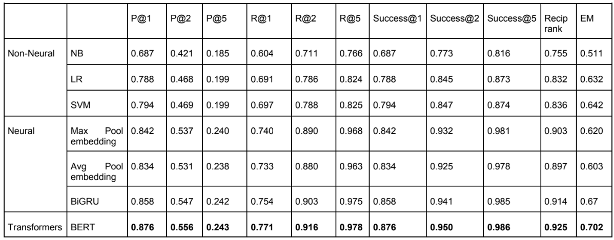

# Natural Language Processing of Aviation Occurrence Reports for Safety Management

## Datasets
### ASRS
|Human Factors             |                          |
|:-------------------------|-------------------------:|
| Communication Breakdown  | Physiological - Other    |
| Confusion                | Situational Awareness    | 
| Distraction              | Time Pressure            |
| Fatigue                  | Training / Qualification |
| Human-Machine Interface  | Troubleshooting          |
| Other / Unknown Workload |                          |

Distribution of human factors:

### CADORS
|Occurrence Categories                                                 |                            |
|:---------------------------------------------------------------------|----------------------------|
| ATM/CNS                                                              | Ground handling            |
| Abnormal runway contact                                              | Icing                      |
| Abrupt manoeuvre                                                     | Loss of control - ground   |
| Aerodrome                                                            | Loss of control - inflight |
| Airprox/TCAS alert/loss of separation/(near)midair collisions        | Medical                    |
| Bird                                                                 | Navigation Errors          |
| Cabin safety events                                                  | Runway Incursion           |
| Collision with obstacle(s) during take-off or landing whilst airborne|  Runway excursion          |
| Controlled flight into or toward terrain                             | Runway incursion - animal  |
| Fire/smoke (non-impact)                                              | Security related           |
| System/component failure or malfunction [non-powerplant]             | Fuel related               |
| System/component failure or malfunction [powerplant]                 | Ground collision           | 
| Turbulence encounter                                                 | Undershoot/overshoot       |
| Wind shear or thunderstorm                                           |                            |

Distribution of occurrence categories:

## Additional baselines for the task of automatic report categorization.

ASRS:

CADORS:

## Hyperparameters

### Automatic report categorization

### Topic modeling

### Automatic summary generation
